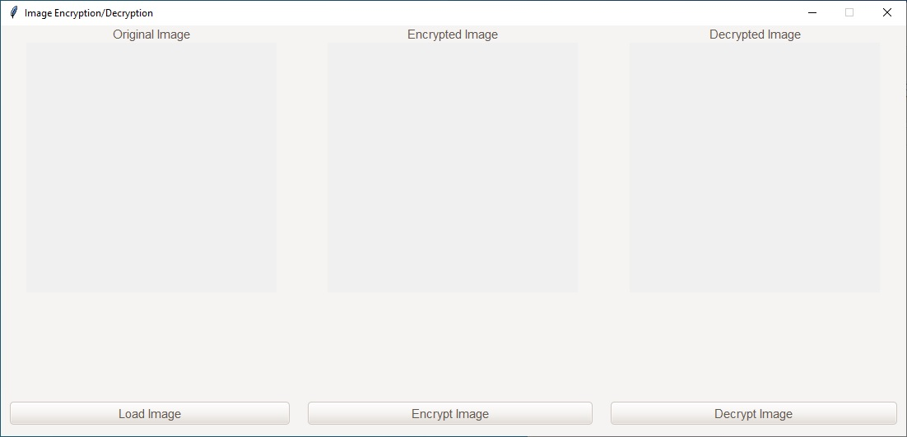

# Image Encryption/Decryption App 🖼️🔒

A Python-based application to **encrypt** and **decrypt** images, keeping your files secure and private. Built with `Tkinter`, `PIL`, and `cryptography`, this tool allows you to easily load, encrypt, and decrypt image files with a user-friendly interface.

## 📖 Table of Contents
- [Features](#features)
- [Screenshots](#screenshots)
- [Installation](#installation)
- [License](#license)
- [Contact](#contact)

## ✨ Features
- Load image files (`.jpg`, `.jpeg`, `.png`, `.bmp`, `.gif`)
- Encrypt images using the `Fernet` symmetric encryption algorithm.
- Decrypt previously encrypted image files.
- Simple and clean UI built with `Tkinter` and `ttkthemes`.
- Save encrypted images to custom file formats.
- Secure key generation and storage.

## 📸 Screenshots
### Main Interface:



## 🛠️ Installation
Follow these steps to install and run the project locally:

1. **Clone the repository**:
   ```bash
   git clone https://github.com/yourusername/image-encryption-app.git
   cd image-encryption-app

## 📥 Download
You can download the latest version of the application from the Releases page on GitHub
https://github.com/zehodotcom/encrypt_image/releases/download/v1.0/Image.EncryptionDecryption.exe

## 📄 License
This project is licensed under the MIT License. See the LICENSE file for details.
[MIT](https://choosealicense.com/licenses/mit/)

## 📧 Contact
For any questions or feedback, feel free to reach out via email:
- [Email](mailto:qulr4p4s@anonaddy.me)
